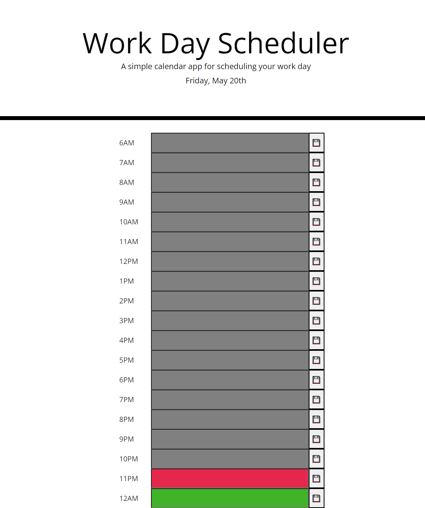

# Workday Scheduler
​
## Table of contents
​
- [Overview](#overview)
  - [The challenge](#the-challenge)
  - [User Story](#user-story)
  - [Acceptance Criteria](#acceptance-criteria)
  - [Screenshot](#screenshot)
  - [Links](#links)
- [My process](#my-process)
  - [Built with](#built-with)
  - [What I learned](#what-i-learned)
  - [Continued development](#continued-development)
  - [Useful resources](#useful-resources)
- [Author](#author)
​
## Overview
​
### The challenge
​
Create a work day scheduler/ agenda that users can see past, current and upcoming to-do's. 
​
### User Story
​
```
AS AN employee with a busy schedule
I WANT to add important events to a daily planner
SO THAT I can manage my time effectively
```
​
### Acceptance Criteria
​
```
GIVEN I am using a daily planner to create a schedule
WHEN I open the planner
THEN the current day is displayed at the top of the calendar
WHEN I scroll down
THEN I am presented with time blocks for standard business hours
WHEN I view the time blocks for that day
THEN each time block is color-coded to indicate whether it is in the past, present, or future
WHEN I click into a time block
THEN I can enter an event
WHEN I click the save button for that time block
THEN the text for that event is saved in local storage
WHEN I refresh the page
THEN the saved events persist
```
### Screenshot
​

​
### Links
​
- Live Site URL: [Workday Scheduler](https://ocampoad.github.io/Work_Day_Scheduler/)
​
## My process
​
### Built with
​
- Moment.js
- Javascript
- Jquery
​
### What I learned
​
I learned how to use third party API' such as Moment.js and Jquery. With the help of the documentation, I was able to implement current date and time to the application. In addition, I also learned how to target html elements, class, and css attributes using Jquery. I learned how to store data in local storage on the browser. 
​
### Continued development
​
I would like to learn more about 
```
event.target
``` 
and traversing through parent and child elements more efficiently. I was able to scratch the surface on how to use event.targer but would like to learn more about it. I will also use the methods I learned using third party API's and apply it to other API's
​
### Useful resources
​
- [Moment.js](https://momentjs.com/) - Their documentation helped me obtain current time and date
- [Jquery](https://jquery.com/) - I was able to learn how to use jquery using their documentation
- [W3schools](https://www.w3schools.com/js/default.asp) - Their easy to use website was helpful showing examples for each new chapters
- [Stackoverflow](https://stackoverflow.com/) - Helpful for more specific question regarding a technique I could not find at other websites
​
## Author
​
- Website - [Adriane Ocampo](https://ocampoad.github.io/Adriane_Ocampo_Portfolio/)
​